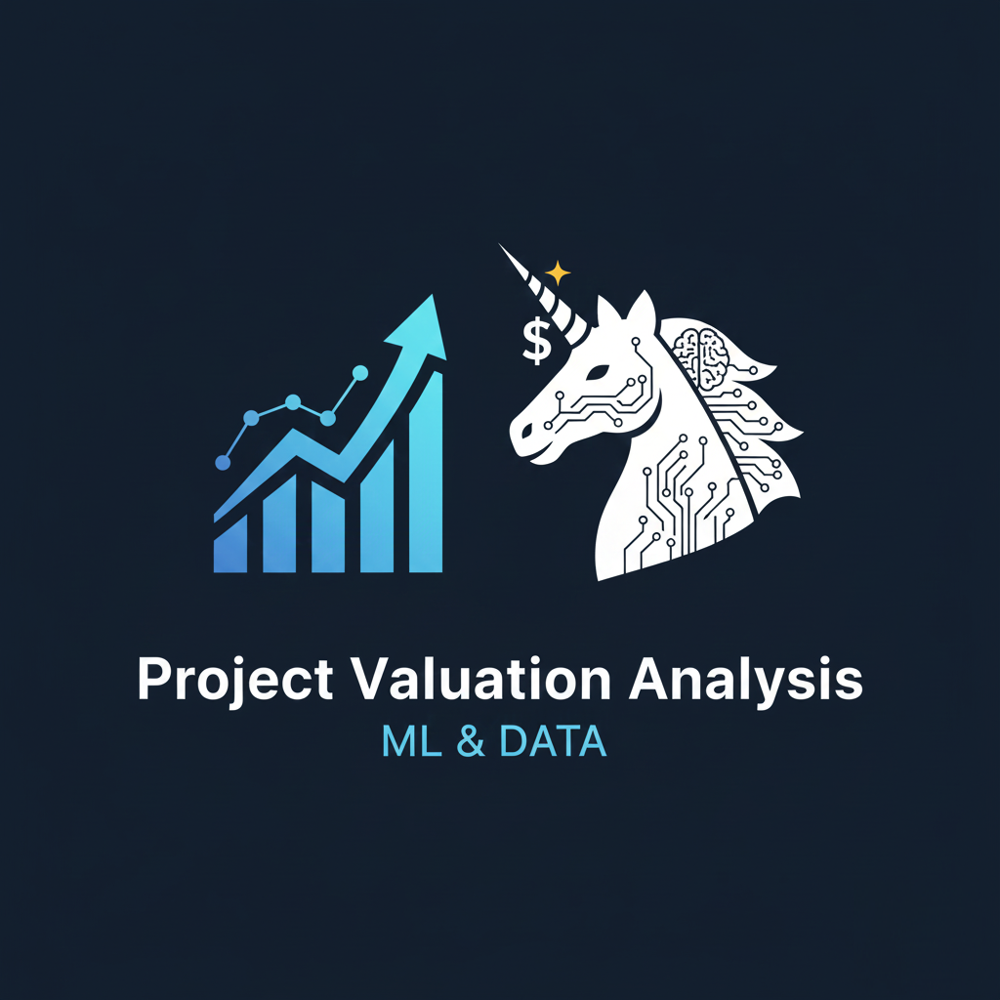
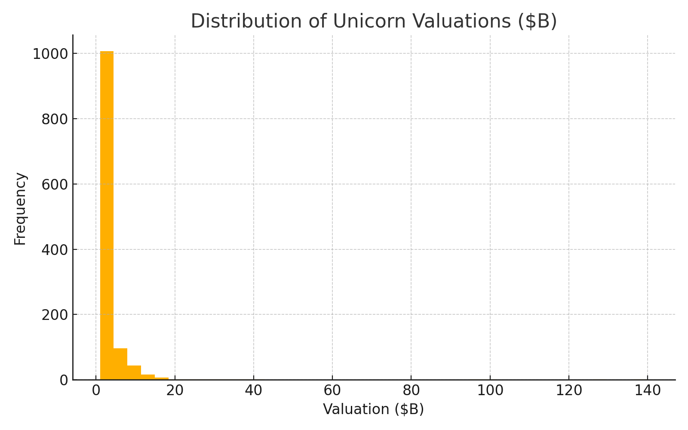

  

  <!-- Python Version -->
  

  <!-- Scikit-Learn -->
  

  <!-- Pandas -->
  

  <!-- NumPy -->
  

  <!-- Visualization Libraries -->
  

  <!-- Flask API -->
  

  <!-- Dataset Size -->
  

  <!-- Jupyter Notebook -->
  

  <!-- Project Status -->
  

# 📊 Project Valuation Analysis — Machine Learning & Data Analytics

A comprehensive machine learning and data analytics project focused on analyzing and predicting the valuations of Unicorn companies (privately held startups valued at over $1B). This project covers the entire ML lifecycle, from data processing and exploratory analysis to model training, optimization, and API deployment.

## ⭐ Features

* **End-to-end ML Workflow:** Complete pipeline from raw data to a production-ready model.
* **Global Dataset:** Analysis of Unicorn companies worldwide from **2012–2022**.
* **In-depth EDA:** Extensive exploratory data analysis with charts and insights.
* **Predictive Models:** Implementation of **Linear Regression** (baseline) and optimized **Random Forest**.
* **Hyperparameter Tuning:** Optimization using `GridSearchCV`.
* **Sector & Investor Analysis:** Insights into dominant sectors and high-frequency investors.
* **Deployment-Ready API:** A lightweight **Flask API** for serving valuation predictions.

---

## 📁 Project Structure
├── Project_Valuation_Analysis.ipynb                     
├── Project Valuation Analysis_ ML _ DA projects.pdf     
├── unicorns till sep 2022.csv                            
└── README.md                                            

## 📄 Dataset Overview

The dataset includes **1186 unicorn companies** with attributes such as `Company`, `Valuation ($B)`, `Join date`, `Country & City`, `Industry`, and `Investors`.

### Data Cleaning and Transformation

Extensive pre-processing was performed to ensure data quality:

* ✔ Removal of missing values.
* ✔ Conversion of valuation strings to numeric types.
* ✔ Parsing dates into year/month features.
* ✔ Splitting and transforming investor lists.
* ✔ Handling inconsistent sector labels.

## 🔍 Exploratory Data Analysis (EDA)

The `Project_Valuation_Analysis.ipynb` notebook provides detailed visualizations, including pie charts, bar charts, line graphs, and correlation heatmaps.

---

### 📌 Key Insights

* The **US** accounts for approximately **54%** of all global Unicorn companies.
* **Fintech** is identified as the most dominant sector by unicorn count.
* **Rapid unicorn growth** was observed in the years between **2018–2021**.

### 📸 Visualization Highlights

Here are a few key visualizations from our exploratory data analysis:

#### 🟦 Distribution of Unicorn Valuations

This histogram illustrates the distribution of valuations among Unicorn companies. It clearly shows that a vast majority of unicorns are valued at or near the $1 Billion threshold, with a long tail indicating a few highly valued outliers.

  

#### 🌍 Top 10 Countries Producing Unicorns

This pie chart highlights the top countries that have produced Unicorn companies. The United States dominates by a significant margin, followed by China and India, showcasing regional concentrations of high-growth startups.

  

## 🤖 Machine Learning Workflow

### 1. Data Preparation

* Feature Scaling
* One-hot Encoding for categorical features
* Null value imputation (if necessary)
* Train-test split for model validation

### 2. Models Trained

| Model | Purpose | Notes |
| :--- | :--- | :--- |
| **Linear Regression** | Baseline model | Used as a simple benchmark. |
| **Random Forest** | Main predictive model | Non-linear, robust, and handles high-dimensional data well. |

### 3. Evaluation and Optimization

| Metric | Optimization | Optimized Hyperparameters |
| :--- | :--- | :--- |
| **Mean Squared Error (MSE)** | `GridSearchCV` | `n_estimators` |
| **R² Score** | Feature Importance | `max_depth` |
| **Feature Importance** | | `min_samples_split` |

---

## 👨‍💻 Author

**Aditya Sharma**  
Data Scientist | Business Intelligence Developer 

---

## 📄 License

This project is intended for educational and portfolio purposes.  
Please attribute the author if you reuse or reference this work.

---
